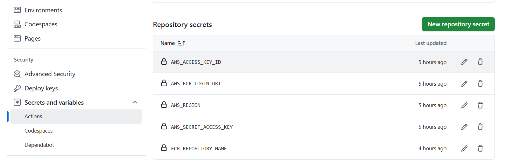
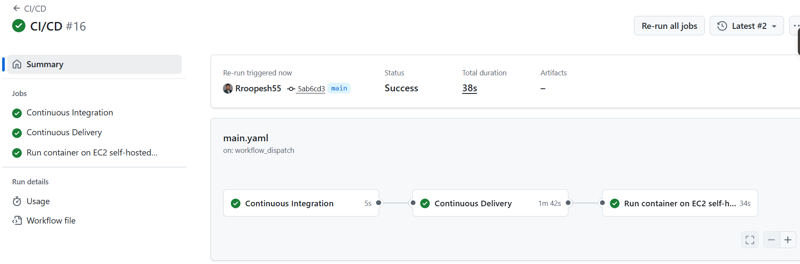

# 🎓 Student Performance Predictor

<div align="center">
  
  [](https://www.python.org/)
  
  [](https://flask.palletsprojects.com/)
  [](https://www.docker.com/)
  [](https://aws.amazon.com/)
  [](LICENSE)
  
  **Predict a student's Mathematics score from demographics and study-related inputs using a productionized ML pipeline**
  
  *Built with Sklearn | Flask Web UI | Dockerized | Deployed on AWS (Beanstalk & ECR→EC2 via GitHub Actions)*

</div>

---

## 📋 Table of Contents

- [🎯 Demo](#-demo)
- [✨ Features](#-features)
- [📁 Project Structure](#-project-structure)
- [📊 Data](#-data)
- [🤖 Model Overview](#-model-overview)
- [🚀 Quickstart](#-quickstart)
  - [Run Locally (Python)](#run-locally-python)
  - [Run with Docker](#run-with-docker)
- [⚙️ Configuration](#️-configuration)
- [🌐 Routes / API](#-routes--api)
- [🔧 Training Pipeline](#-training-pipeline)
- [🎯 Inference Pipeline](#-inference-pipeline)
- [📝 Logging & Errors](#-logging--errors)
- [🔄 CI/CD (GitHub Actions → ECR → EC2)](#-cicd-github-actions--ecr--ec2)
- [☁️ Deployment on AWS Elastic Beanstalk](#️-deployment-on-aws-elastic-beanstalk)
- [📸 Screenshots](#-screenshots)
- [🐛 Troubleshooting](#-troubleshooting)
- [🔒 Security & Cost Notes](#-security--cost-notes)
- [🗺️ Roadmap](#️-roadmap)
- [📄 License](#-license)
- [🙏 Acknowledgements](#-acknowledgements)

---

## 🎯 Demo

**🔗 Live URL**: `http://<your-ec2-public-ip>:8080/` _(hosted on EC2, port 8080)_

> 💡 See [Screenshots](#-screenshots) for the homepage, form, and prediction result.

---

## ✨ Features

| Feature                      | Description                                                                                                        |
| ---------------------------- | ------------------------------------------------------------------------------------------------------------------ |
| 🎯 **Math Score Prediction** | Predict from 7 inputs (gender, race/ethnicity, parental education, lunch, test prep, reading score, writing score) |
| 🧰 **End-to-End Pipeline**   | Ingestion → Transform → Model Training → Evaluation → Persisted Artifacts                                          |
| 🌐 **Flask Web UI**          | Simple two-page flow (index & predict)                                                                             |
| 🐳 **Dockerized App**        | Easy to run locally or in the cloud                                                                                |
| 🚀 **Two AWS Deployments**   | • Elastic Beanstalk (Python platform)<br>• GitHub Actions → Amazon ECR → EC2 self-hosted runner                    |

---

## 📁 Project Structure

```bash
.
├─ 📂 .ebextensions/
│  └─ python.config                # Beanstalk: WSGI path / platform opts (optional)
├─ 📂 .github/
│  └─ 📂 workflows/
│     └─ main.yaml                 # CI (build) + CD (push to ECR & run on EC2)
├─ 📂 artifacts/
│  ├─ data.csv                     # Raw snapshot used locally
│  ├─ train.csv, test.csv          # Split datasets
│  ├─ preprocessor.pkl             # Saved ColumnTransformer (OneHot + Scale + Impute)
│  └─ model.pkl                    # Trained best model serialized
├─ 📂 logs/                        # (Optional) runtime/training logs
├─ 📂 notebook/                    # (Optional) experiments
├─ 📂 src/
│  ├─ 📂 components/
│  │  ├─ data_ingestion.py         # Read dataset, write artifacts/{raw,train,test}.csv
│  │  ├─ data_transformation.py    # Build & persist sklearn preprocessor
│  │  ├─ model_trainer.py          # Train/evaluate models, save best model
│  │  └─ 📂 artifacts/             # (component-specific outputs if any)
│  ├─ 📂 pipeline/
│  │  ├─ train_pipeline.py         # (optional) training entrypoint
│  │  └─ predict_pipeline.py       # Load artifacts & predict on new data
│  ├─ exception.py                 # CustomException with context
│  ├─ logger.py                    # Logging helper
│  └─ utils.py                     # save_object, evaluate_models, helpers
├─ 📂 templates/
│  ├─ index.html                   # Landing page
│  └─ home.html                    # Form + prediction result
├─ app.py                          # Flask app (Gunicorn entrypoint: `app:application`)
├─ Dockerfile                      # 3.11-slim base + gunicorn
├─ requirements.txt                # Pinned libs compatible with train/infer
├─ setup.py                        # (optional) packaging
└─ README.md
```

---

## 📊 Data

The dataset contains **student demographics and study attributes** with target `math_score`.

### 📋 Columns

- `gender`
- `race_ethnicity`
- `parental_level_of_education`
- `lunch`
- `test_preparation_course`
- `reading_score`
- `writing_score`
- `math_score` _(target)_

The pipeline performs an **80/20 train/test split** (`random_state=42`) and persists `train.csv`, `test.csv` for reproducibility.

> ⚠️ **Note**: Use your own dataset or ensure you have the right to use and distribute it.

---

## 🤖 Model Overview

### 📈 Models Evaluated (sklearn & friends)

- Linear Regression, Lasso, Ridge
- K-Nearest Neighbors Regressor
- Decision Tree, Random Forest Regressor
- XGBRegressor (XGBoost)
- CatBoosting Regressor

### 🔬 Hyperparameter Tuning

Each model underwent **comprehensive hyperparameter tuning** using modular programming approach:

| Model             | Hyperparameters Tuned                                                |
| ----------------- | -------------------------------------------------------------------- |
| **Ridge**         | `alpha`: [0.1, 0.5, 1.0, 5.0, 10.0]                                  |
| **Lasso**         | `alpha`: [0.001, 0.01, 0.1, 1.0]                                     |
| **Random Forest** | `n_estimators`, `max_depth`, `min_samples_split`, `min_samples_leaf` |
| **XGBoost**       | `learning_rate`, `n_estimators`, `max_depth`, `subsample`            |
| **CatBoost**      | `iterations`, `learning_rate`, `depth`                               |
| **KNN**           | `n_neighbors`: [3, 5, 7, 9, 11]                                      |
| **Decision Tree** | `max_depth`, `min_samples_split`, `min_samples_leaf`                 |

**Tuning Strategy:**

- GridSearchCV with 5-fold cross-validation
- Automated hyperparameter selection in `src/utils.py`
- Modular design allows easy parameter updates

### 🏆 Results (After Hyperparameter Tuning)

| Model             | Test R² | RMSE | Best Parameters                       |
| ----------------- | ------- | ---- | ------------------------------------- |
| **Ridge (Best)**  | 0.8806  | 5.39 | `alpha=1.0`                           |
| Linear Regression | 0.8803  | -    | Default                               |
| CatBoost          | 0.852   | -    | `depth=6, iterations=100`             |
| Random Forest     | 0.847   | -    | `n_estimators=100, max_depth=10`      |
| XGBoost           | 0.822   | -    | `learning_rate=0.1, n_estimators=100` |
| KNN               | 0.784   | -    | `n_neighbors=5`                       |
| Decision Tree     | 0.760   | -    | `max_depth=5`                         |

### 💾 Artifacts

- `artifacts/preprocessor.pkl` — OneHotEncoder (categoricals) + StandardScaler (numericals), with imputers
- `artifacts/model.pkl` — Best model by test R² (with optimal hyperparameters)

---

## 🚀 Quickstart

### Run Locally (Python)

**Prerequisites**: Python 3.11 recommended

```bash
# 1) Clone the repository
git clone https://github.com/<you>/Complete_ML_Project.git
cd Complete_ML_Project

# 2) Create virtual environment
python -m venv .venv
source .venv/bin/activate   # Windows: .venv\Scripts\activate

# 3) Install dependencies
pip install --upgrade pip
pip install -r requirements.txt

# 4) Run the application
python app.py
# OR using gunicorn:
# gunicorn -w 2 -k gthread -b 0.0.0.0:8080 app:application

# 5) Open http://localhost:8080
```

### Run with Docker

```bash
# Build the image
docker build -t student-performance:latest .

# Run the container (container port 8080 → host 8080)
docker run --rm -p 8080:8080 student-performance:latest

# Open http://localhost:8080
```

---

## ⚙️ Configuration

| Setting       | Value        | Description                                                         |
| ------------- | ------------ | ------------------------------------------------------------------- |
| **Port**      | 8080         | Container binds to `0.0.0.0:8080` (change with `-p HOST:CONTAINER`) |
| **Artifacts** | `artifacts/` | Expects `preprocessor.pkl` and `model.pkl` at runtime               |
| **Env Vars**  | None         | No environment variables required for basic usage                   |

---

## 🌐 Routes / API

| Method | Endpoint       | Description                                        |
| ------ | -------------- | -------------------------------------------------- |
| `GET`  | `/`            | Home / landing page (`templates/index.html`)       |
| `GET`  | `/predictdata` | Renders form (`templates/home.html`)               |
| `POST` | `/predictdata` | Accepts form inputs → returns predicted Math score |

---

## 🔧 Training Pipeline

### 1️⃣ Data Ingestion

Reads dataset → writes `artifacts/data.csv`, `train.csv`, `test.csv`

### 2️⃣ Data Transformation

**Numerical Features** (`reading_score`, `writing_score`):

- SimpleImputer(median)
- StandardScaler

**Categorical Features** (`gender`, `race_ethnicity`, `parental_level_of_education`, `lunch`, `test_preparation_course`):

- SimpleImputer(most_frequent)
- OneHotEncoder
- Scaling

→ Persisted as `artifacts/preprocessor.pkl`

### 3️⃣ Model Training

- Trains multiple regression models with **hyperparameter tuning**
- Uses **GridSearchCV** for optimal parameter selection
- Evaluates models using cross-validation
- Reports comprehensive metrics on train/test sets
- Implemented in modular fashion in `src/components/model_trainer.py`

### 4️⃣ Selection & Persist

- Selects best model based on R² score on test set
- Ridge Regression selected (R² = 0.8806) with optimal hyperparameters
- Model saved with fitted parameters as `artifacts/model.pkl`

---

## 🎯 Inference Pipeline

`PredictPipeline` loads `preprocessor.pkl` & `model.pkl`, applies the same transforms, and returns a numeric Math score prediction.

**Inputs from form:**

- `gender`
- `race_ethnicity`
- `parental_level_of_education`
- `lunch`
- `test_preparation_course`
- `reading_score`
- `writing_score`

---

## 📝 Logging & Errors

- **`src/logger.py`** — Standard logging with info statements around key pipeline steps
- **`src/exception.py`** — CustomException with filename/line/context to ease debugging

---

## 🔄 CI/CD (GitHub Actions → ECR → EC2)

### Workflow on `main` push (and manual dispatch):

1. **CI**: Lint/tests (placeholder)
2. **Build & Push**: Docker image → Amazon ECR
3. **Deploy**: Self-hosted runner on EC2 pulls and runs:

```bash
docker rm -f ml_project_container || true
docker run -d --name ml_project_container -p 8080:8080 <image-uri>
```

### 🔑 Required Repository Secrets

| Secret                  | Description                |
| ----------------------- | -------------------------- |
| `AWS_ACCESS_KEY_ID`     | AWS access key             |
| `AWS_SECRET_ACCESS_KEY` | AWS secret key             |
| `AWS_REGION`            | e.g., `us-east-2`          |
| `AWS_ACCOUNT_ID`        | 12-digit account ID        |
| `ECR_REPOSITORY_NAME`   | e.g., `studentperformance` |



### 🖥️ Self-hosted Runner (EC2)

- **Labels**: `self-hosted`, `Linux`, `X64`
- **Setup**: Install Docker (`apt install -y docker.io`), enable service, add runner user to docker group
  

## Github workflow

## 

## ☁️ Deployment on AWS Elastic Beanstalk

_Alternative to the ECR/EC2 pipeline_

- **Platform**: Python 3.9/3.13 on Amazon Linux 2023
- **App Code**: Your repo zipped or linked via CodePipeline

### Configuration

`.ebextensions/python.config` example:

```yaml
option_settings:
  "aws:elasticbeanstalk:container:python":
    WSGIPath: application:application
```

> 💡 If your entry is `app.py` with `application = Flask(__name__)`, set `WSGIPath: app:application`

---

## 📸 Screenshots

### 🏠 Homepage


### 📝 Form


### 🎯 Prediction Result


---

## 🐛 Troubleshooting

| Issue                                         | Solution                                                                            |
| --------------------------------------------- | ----------------------------------------------------------------------------------- |
| **Invalid reference format during deploy**    | Ensure `AWS_ACCOUNT_ID`, `AWS_REGION`, `ECR_REPOSITORY_NAME` secrets are set        |
| **Cannot connect to Docker daemon on runner** | Start Docker: `sudo systemctl enable --now docker`; add runner user to docker group |
| **ECR auth errors**                           | Ensure IAM policy includes `ecr:GetAuthorizationToken` and repo push/pull actions   |
| **Port not reachable**                        | EC2 Security Group must allow TCP 8080; if ufw active: `sudo ufw allow 8080/tcp`    |

---

## 🔒 Security & Cost Notes

- ✅ Prefer GitHub OIDC + IAM role over long-lived AWS keys
- ✅ Restrict SG ingress (ideally your IP only) or front app with load balancer/HTTPS reverse proxy
- ✅ Watch EC2/ECR costs; prune unused images, stop instances when idle

---

## 🗺️ Roadmap

- [ ] Add HTTPS via Nginx/Caddy + Let's Encrypt on EC2
- [ ] Versioned image tags (`:sha-<GITHUB_SHA>`) and blue/green deploy
- [ ] Add tests + lint checks in CI
- [ ] Optional REST API endpoint for programmatic prediction
- [ ] Model monitoring and retraining pipeline
- [ ] Performance metrics dashboard

---

## 📄 License

This project is licensed under the **MIT License** - see the [LICENSE](LICENSE) file for details.

---

## 🙏 Acknowledgements

- [scikit-learn](https://scikit-learn.org/), [XGBoost](https://xgboost.readthedocs.io/), [CatBoost](https://catboost.ai/)
- [Flask](https://flask.palletsprojects.com/) & [Jinja](https://jinja.palletsprojects.com/)
- [AWS](https://aws.amazon.com/) (ECR/EC2/Beanstalk)
- [GitHub Actions](https://github.com/features/actions)
- [Docker](https://www.docker.com/)

---

<div align="center">
  
  **Made with ❤️ by [Your Name]**
  
  ⭐ Star this repo if you find it helpful!
  
</div>
